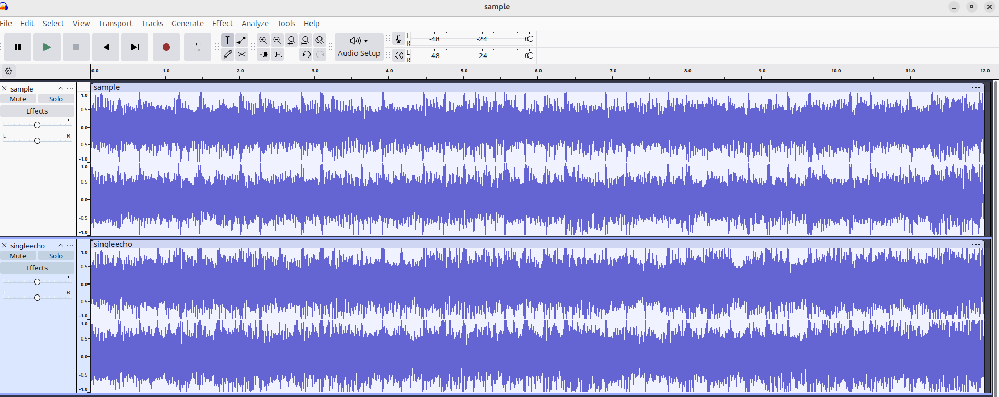
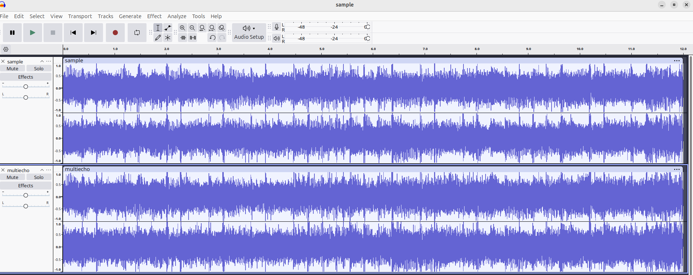
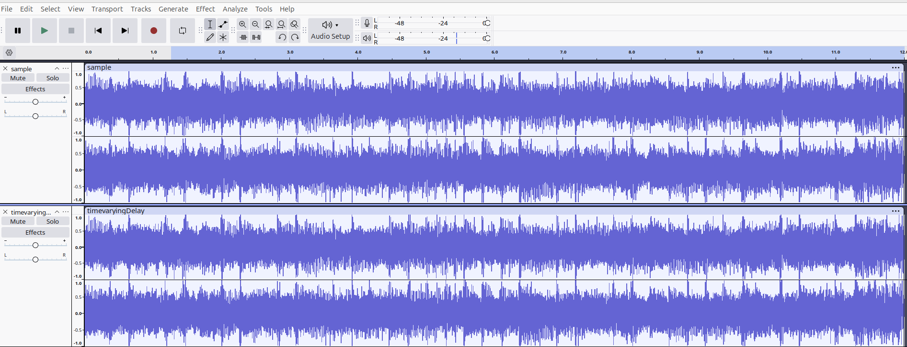
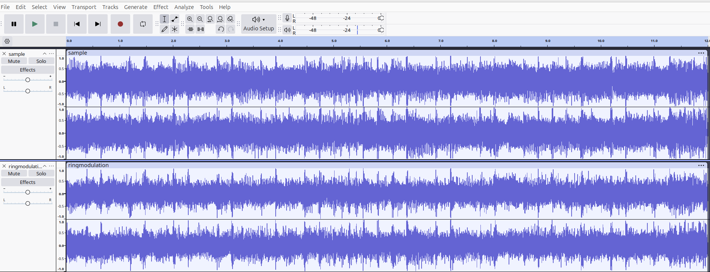

## Implementation

The `wav_effects` program implements a comprehensive audio effects processor that can apply various digital signal processing effects to WAV files. We've implemented the following effects:

### 1. Single Echo

**Command**: `echo <delay_ms> <feedback>`

- **delay_ms**: Echo delay in milliseconds
- **feedback**: Echo strength (0.0 to 1.0)
- **Description**: Creates a single delayed copy of the original signal mixed back in

**Example**: `./wav_effects echo 250 0.4 input.wav output.wav`

### 2. Multiple Echoes

**Command**: `multiecho <delay1,delay2,...> <fb1,fb2,...>`

- **delays**: Comma-separated list of delay times in milliseconds
- **feedbacks**: Comma-separated list of feedback strengths
- **Description**: Creates multiple delayed copies with individual feedback controls

**Example**: `./wav_effects multiecho 100,200,300 0.3,0.2,0.1 input.wav output.wav`

### 3. Amplitude Modulation

**Command**: `ampmod <freq_hz> <depth>`

- **freq_hz**: Modulation frequency in Hz
- **depth**: Modulation depth (0.0 to 1.0)
- **Description**: Multiplies amplitude by a sine wave creating tremolo-like effect

**Example**: `./wav_effects ampmod 5.0 0.5 input.wav output.wav`

### 4. Time-Varying Delay (Chorus/Flanger)

**Command**: `chorus <base_delay_ms> <mod_freq_hz> <mod_depth_ms> <feedback> <wet_mix>`

- **base_delay_ms**: Base delay time in milliseconds
- **mod_freq_hz**: Modulation frequency in Hz
- **mod_depth_ms**: Modulation depth in milliseconds
- **feedback**: Feedback amount (0.0 to 1.0)
- **wet_mix**: Wet/dry mix (0.0 = dry, 1.0 = wet)
- **Description**: Delay time varies sinusoidally creating chorus or flanger effects

**Example**: `./wav_effects chorus 10 1.5 5 0.3 0.5 input.wav output.wav`

### 5. Ring Modulation

**Command**: `ringmod <carrier_freq_hz>`

- **carrier_freq_hz**: Carrier frequency in Hz
- **Description**: Multiplies signal by sine wave creating metallic, robotic sounds

**Example**: `./wav_effects ringmod 440 input.wav output.wav`

### 6. Distortion (Soft Clipping)

**Command**: `distort <gain> <threshold>`

- **gain**: Input gain multiplier
- **threshold**: Clipping threshold (0.0 to 1.0)
- **Description**: Soft clipping distortion using hyperbolic tangent

**Example**: `./wav_effects distort 2.0 0.7 input.wav output.wav`

### 7. Reverse

**Command**: `reverse`

- **Description**: Reverses the entire audio file
- **Parameters**: None

**Example**: `./wav_effects reverse input.wav output.wav`

### 8. Fade In/Out

**Commands**: `fadein <duration_ms>` or `fadeout <duration_ms>`

- **duration_ms**: Fade duration in milliseconds
- **Description**: Linear fade in from silence or fade out to silence

**Examples**:

- `./wav_effects fadein 500 input.wav output.wav`
- `./wav_effects fadeout 1000 input.wav output.wav`

## Results

The following images compare an original audio sample with the same sample after applying one of the effects in `wav_effects`

_Figure 1: The audio sample before and after applying an echo effect with a 250 ms delay and 0.4 feedback._

_Figure 2: The audio sample before and after applying an multiecho effect with a 100 ms delay and 0.3 feedback, 200ms and 0.2 feedback and 300ms and 0.1 feedback._

_Figure 3: The audio sample before and after applying an amplitude modulation effect with a 5 Hz frequency and 0.5 depth._

_Figure 4: The audio sample before and after applying a time-varying delay with a 10 ms base delay, 1.5 Hz modulation frequency, 5 ms modulation depth, 0.3 feedback, and 0.5 wet/dry mix_

_Figure 5: The audio sample before and after applying a ring modulation effect using a 440 Hz carrier frequency._

_Figure 6: The audio sample before and after applying a distortion effect using a gain of 2 and a threshold of 0.7._

_Figure 7: The audio sample before and after applying the reverse effect._

_Figure 8: The audio sample before and after applying a fade-in effect over 500ms._
